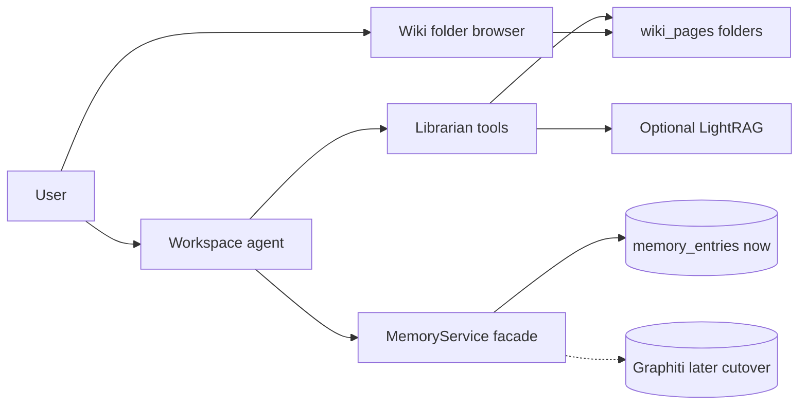

# Plan — Second Brain (wiki + pamięć życiowa)

**Data:** 2026-07-23  
**Status:** `planned`  
**Referencje:** [LLM Wiki / Karpathy](https://natural20.com/using-claude-code-to-setup-a-second-brain-aka-llm-wiki), [LightRAG MCP](https://github.com/a-earthperson/lightrag-mcp), [Graphiti MCP](https://help.getzep.com/graphiti/getting-started/mcp-server)

## Cel

Second Brain w AI Workspace: **wiki/wiedza** (przeglądarka z folderami + bibliotekarz) oraz **jedna pamięć życiowa** (dziś flat `memory_entries`, później Graphiti jako następca). Bez Obsidiana jako zależności.

## Decyzje (ustalone)

- **Forma:** multi-tenant wiki w aplikacji (Markdown / strony u nas).
- **UI:** przeglądarka z folderami (`Raw` / `Inbox` / `Wiki/Entities|Concepts|Summaries` + Index/Log), podgląd Markdown, graf — nasz Vue.
- **Timing:** po podstawach RAG (Faza 4), **przed Gmailem** (Faza 2).
- **Buy/build:** LightRAG (opcjonalnie) = silnik retrieval/grafu **pod spodem**; foldery przeglądamy u nas.
- **Pamięć:** zawsze **jeden** store życiowy. Graphiti = cutover, nie drugi równoległy mózg.

## Model produktowy

Dwie warstwy dla LLM — różne obszary, zakresy i use-case’y.

| Warstwa | Co to jest | Use-case | Zakres | Jak trafia do LLM |
|---------|------------|----------|--------|-------------------|
| **Wiki / wiedza** | Baza ze źródeł: dokumenty, encje, relacje, tagi, foldery, cytaty | „Co wiemy o X z materiałów?” | tenant → user (później team) | głównie toole (`ingest` / `query`) |
| **Pamięć życiowa** | Preferencje, ustalenia, kto–co–kiedy | „Co już ustaliliśmy?” | session / user / agent | injection + toole; jeden backend |

- Wiki nie idzie cała w system prompt — agent sięga toolami.
- Memory injection zostaje jako mechanizm; zmienia się tylko store za facade.
- RAG dokumentów (Faza 4) = infrastruktura pod KB, nie trzecia pamięć życiowa.

### Mapowanie na „drugi mózg” z artykułu

| Element artykułu | U nas |
|------------------|-------|
| Obsidian (przeglądarka) | UI folderów + graf w Workspace |
| Claude Code (bibliotekarz) | Pętla agenta + toole ingest/query/lint |
| Vault Markdown | `wiki_pages` (+ opcjonalnie LightRAG pod retrieval) |
| (poza artykułem) pamięć preferencji | `MemoryService` → dziś pgvector, potem Graphiti |

LightRAG ≈ wiedza ze źródeł. Graphiti ≈ pamięć życiowa. Żaden sam nie jest całym wzorcem Karpathy.

## Pamięć: jeden store, cutover (nie dual-write)

Tak — flat memory i Graphiti **gryźłyby się**, gdyby działały równolegle.

1. **Teraz:** tylko `memory_entries` + injection.
2. **Potem:** spike Graphiti → facade `MemoryService` → migracja → wyłączenie starego zapisu.
3. **Zakaz:** dwa aktywne write-pathy memory na produkcji.

Konflikt memory↔wiki: prompt — krótki fakt → memory; treść ze źródła → wiki ingest.

### Graphiti — trwałość i injection

- **Trwałość:** długotrwała, **między sesjami** (temporalny KG). Izolacja per user/tenant (`group_id` / facade).
- **Sesja chat** = wątek; pamięć user/agent przeżywa wiele sesji.
- **Injection:** Graphiti sam nie wstrzykuje do promptu Workspace — daje search API. Injection kontekstowe robimy w `MemoryService.build_injection_context` (dziś pgvector; po cutover Graphiti za tym samym API) + toole na żądanie.

## LightRAG vs Graphiti (kolejność)

| Zdolność | Kandydat | Kiedy |
|----------|----------|--------|
| Knowledge / GraphRAG | LightRAG (lub sam pgvector na `wiki_pages`) | Najpierw (luka wiedzy ze źródeł) |
| Memory graph | Graphiti (+ FalkorDB) | Później, jako następca memory |

Nie stawiamy obu Dockery naraz na starcie.

**Flexible GraphRAG** — odrzucić jako shell produktu (za ciężki, własny UI); ewentualnie inspiracja API.

## Architektura docelowa

- Workspace = chat + przeglądarka folderów.
- LightRAG (jeśli go) = opcjonalny backend retrieval, nie UI.
- Porty VPS: izolowany compose; nie w katalogach `_`.

## Spike LightRAG (1–2 dni) — go / no-go

**Go**, gdy: ACL tenant/user, OpenRouter/embeddings OK, latency/ops OK na VPS, da się spiąć z naszymi stronami/folderami.

**No-go:** retrieval tylko u nas (pgvector na `wiki_pages`).

**Niezależnie od wyniku:** UI folderów + `wiki_pages` zostają (wymóg produktu).

**In spike:** compose, 3–5 źródeł, wywołanie z agenta, checklista ACL.  
**Out:** LightRAG jako jedyny UI, Flexible GraphRAG jako shell, Obsidian, dual-write memory.

## Timing (roadmapa)

1. Faza 1.5 (design) — bieżąca praca  
2. Podstawy RAG (retrieval + ACL)  
3. **Faza 4.5:** `wiki_pages` + przeglądarka folderów + toole bibliotekarza (+ opcjonalnie LightRAG)  
4. Później: Graphiti cutover memory  
5. Faza 2 Gmail  

## Dokumentacja do domknięcia przy starcie prac

- `docs/research/…--second-brain-buy-vs-build.md` — wynik spike LightRAG; Graphiti jako następca memory  
- Aktualizacja `docs/MVP.md`: Faza 4.5 Second Brain; punkt „memory graph cutover”; Gmail po 4.5  

## Todos

| ID | Treść |
|----|--------|
| docs-research-buy-vs-build | Research spike LightRAG vs Graphiti vs Flexible + wpis research |
| gate-rag-basics | Domknąć podstawy RAG przed / równolegle |
| spike-docker-mcp | Spike LightRAG 1–2 dni |
| decide-path | Go/no-go LightRAG; aktualizacja MVP.md |
| wiki-folder-browser | UI: foldery + podgląd + graf |
| path-mcp-or-pages | Backend: adapter LightRAG i/lub wiki_pages + toole |
| later-graphiti-memory | Graphiti zastępuje memory_entries (facade → cutover) |

## Ryzyka

- Dual memory → facade + cutover  
- Ops LightRAG → tylko po „go”  
- Vendor drift → pin obrazu; retrieval za interfejsem  
- Koszt ripple bibliotekarza przy wielu stronach  
