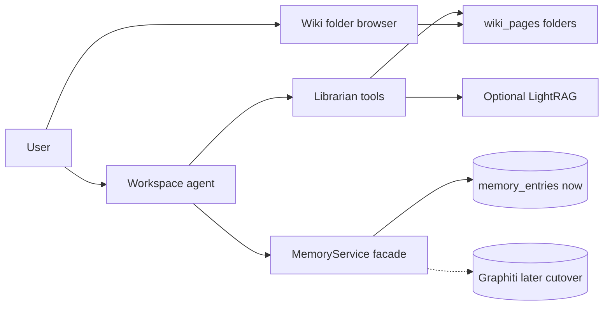

# Plan — Second Brain (wiki + pamięć życiowa)

**Data:** 2026-07-23  
**Status:** `planned`  
**Referencje:** [LLM Wiki / Karpathy](https://natural20.com/using-claude-code-to-setup-a-second-brain-aka-llm-wiki), [LightRAG MCP](https://github.com/a-earthperson/lightrag-mcp), [Graphiti MCP](https://help.getzep.com/graphiti/getting-started/mcp-server)  
**Review:** uwagi z 2026-07-23 domknięte poniżej (sekcja „Rozstrzygnięcia po review”).

## Cel

Second Brain w AI Workspace: **wiki/wiedza** (przeglądarka z folderami + bibliotekarz) oraz **jedna pamięć życiowa** (dziś flat `memory_entries`, później Graphiti jako następca). Bez Obsidiana jako zależności.

## Decyzje (ustalone)

- **Forma:** multi-tenant wiki w aplikacji (Markdown / strony u nas).
- **UI:** przeglądarka z folderami (`Raw` / `Inbox` / `Wiki/Entities|Concepts|Summaries` + Index/Log), podgląd Markdown, graf — nasz Vue.
- **ACL wiki (MVP):** **per-user w tenancie** — user widzi i mutuje tylko swoje strony (`tenant_id` + `user_id`). Team-shared wiki = później (bez `team_id` w schemacie MVP).
- **Flow bibliotekarza:** jawne `wiki_ingest` = **auto** (Raw → Summary → ripple Entities/Concepts, bez approve per strona). **Inbox** = drafty / digest; **bez auto-promocji** do Wiki — dopiero po jawnym ingest. Usuwanie / deprecate = pytaj użytkownika.
- **Timing:** po podstawach RAG (Faza 4), **przed Gmailem** (Faza 2).
- **Buy/build:** LightRAG (opcjonalnie) = silnik retrieval/grafu **pod spodem**; foldery przeglądamy u nas.
- **Multi-tenant silników:** **jedna instancja** + namespace `tenant_id:user_id`. Brak twardej izolacji w API = **no-go** (nie mnożymy kontenerów per tenant).
- **Pamięć:** zawsze **jeden** store życiowy. Graphiti = cutover z rollbackiem (patrz niżej), nie drugi równoległy mózg.
- **Migracje DB:** numer = **następny wolny w momencie startu prac**. Plan `002` (attachments) rezerwuje `062` — **nie hardkodować** numeru wiki w tym dokumencie.

## Model produktowy

Dwie warstwy dla LLM — różne obszary, zakresy i use-case’y.

| Warstwa | Co to jest | Use-case | Zakres | Jak trafia do LLM |
|---------|------------|----------|--------|-------------------|
| **Wiki / wiedza** | Baza ze źródeł: dokumenty, encje, relacje, tagi, foldery, cytaty | „Co wiemy o X z materiałów?” | **tenant + user** (team później) | głównie toole (`ingest` / `query`) |
| **Pamięć życiowa** | Preferencje, ustalenia, kto–co–kiedy | „Co już ustaliliśmy?” | session / user / agent | injection + toole; jeden backend |

- Wiki nie idzie cała w system prompt — agent sięga toolami.
- Memory injection zostaje jako mechanizm; zmienia się tylko store za facade.
- RAG dokumentów (Faza 4) = infrastruktura pod KB, nie trzecia pamięć życiowa.

### Mapowanie na „drugi mózg” z artykułu

| Element artykułu | U nas |
|------------------|-------|
| Obsidian (przeglądarka) | UI folderów + graf w Workspace |
| Claude Code (bibliotekarz) | Pętla agenta + toole ingest/query/lint |
| Vault Markdown | `wiki_pages` (+ opcjonalnie LightRAG pod retrieval) |
| (poza artykułem) pamięć preferencji | `MemoryService` → dziś pgvector, potem Graphiti |

LightRAG ≈ wiedza ze źródeł. Graphiti ≈ pamięć życiowa. Żaden sam nie jest całym wzorcem Karpathy.

### Flow bibliotekarza (MVP)

```
Inbox (digest / capture)  --[jawne wiki_ingest]-->  Raw (immutable)
                                                      |
                                                      v
                                              Summary + ripple
                                              Entities / Concepts
                                                      |
                                                      v
                                              Index + Log (append)
```

- Brak kolejki approve/reject w UI na MVP (ingest = zaufany akt użytkownika).
- `wiki_lint`: report + fix mechaniczny; duże rewrite / delete → potwierdzenie usera.

## Szkic schematu DB (wiki)

Numer migracji: **TBD przy starcie** (nie kolidować z `062` z planu attachments, jeśli attachments wejdzie wcześniej).

### `wiki_pages`

| Kolumna | Typ | Uwaga |
|---------|-----|-------|
| `id` | `String(36)` PK | `generate_id()` |
| `tenant_id` | `String(36)` | izolacja tenanta |
| `user_id` | `String(36)` | właściciel (ACL MVP) |
| `folder` | `String(20)` | `raw` \| `inbox` \| `entities` \| `concepts` \| `summaries` \| `meta` |
| `slug` | `String(200)` | unikalność w `(tenant_id, user_id, folder)` |
| `title` | `Text` | |
| `body_md` | `Text` | treść Markdown |
| `frontmatter` | `JSONB` nullable | tags, dates, unverified flags, … |
| `source_url` | `Text` nullable | głównie Raw / Summaries |
| `status` | `String(20)` | `active` \| `deprecated` |
| `immutable` | `Boolean` | `true` dla Raw po create |
| `created_at` / `updated_at` | `DateTime(tz)` | |

Indeksy: `(tenant_id, user_id, folder)`, `(tenant_id, user_id, updated_at)`.

Seed przy pierwszym użyciu: strony `meta` / slug `index` oraz `meta` / slug `log`.

### `wiki_links`

| Kolumna | Typ | Uwaga |
|---------|-----|-------|
| `id` | `String(36)` PK | |
| `tenant_id` / `user_id` | | denormalizacja pod ACL / graf |
| `from_page_id` | FK `wiki_pages` | |
| `to_page_id` | FK nullable | null = dangling wikilink |
| `to_slug` | `String(200)` | cel przed resolucją |
| `link_text` | `Text` nullable | |

Parsowanie `[[wikilinks]]` przy zapisie strony → rebuild edges dla `from_page_id`.

### Embeddingi

Nie blokują UI folderów. Chunki / wektor: wspólny pipeline Fazy 4 (osobna tabela chunków **albo** kolumna później). LightRAG (jeśli go) indeksuje treść równolegle pod namespaceem.

## Pamięć: jeden store, cutover + rollback

Tak — flat memory i Graphiti **gryźłyby się**, gdyby działały równolegle na zapis.

### Fazy cutover Graphiti

1. **Teraz:** tylko `memory_entries` + injection.
2. **Spike Graphiti** — ACL `group_id` = `tenant_id:user_id` (lub równoważne), metryki jak niżej.
3. **Facade `MemoryService`** — toole + injection za jednym interfejsem; feature flag `MEMORY_BACKEND=pgvector|graphiti`.
4. **Migracja:** skrypt export `memory_entries` → episody/fakty Graphiti (per user); walidacja counts / sample search.
5. **Dual-read:** write → Graphiti; read → Graphiti primary, **fallback** `memory_entries` przy miss/error (okno zabezpieczające, bez dual-**write**).
6. **Cutover write-only Graphiti** — stara tabela **read-only** (backup) przez **N dni** (domyślnie 14).
7. **Drop / archive** starej tabeli po stabilności.

**Rollback:** flip flagi `MEMORY_BACKEND=pgvector`; dane w `memory_entries` nietknięte do końca okna read-only. Po dropie rollback = tylko restore z backupu DB (świadomie).

**Zakaz:** dwa aktywne write-pathy memory na produkcji.

Konflikt memory↔wiki: prompt — krótki fakt → memory; treść ze źródła → wiki ingest.

### Graphiti — trwałość i injection

- **Trwałość:** długotrwała, **między sesjami**. Izolacja per user/tenant przez `group_id` / facade.
- **Sesja chat** = wątek; pamięć user/agent przeżywa wiele sesji.
- **Injection:** Graphiti nie wstrzykuje sam — search API; my wołamy w `build_injection_context` + toole.

## LightRAG vs Graphiti (kolejność)

| Zdolność | Kandydat | Kiedy |
|----------|----------|--------|
| Knowledge / GraphRAG | LightRAG (lub sam pgvector na `wiki_pages`) | Najpierw (luka wiedzy ze źródeł) |
| Memory graph | Graphiti (+ FalkorDB) | Później, jako następca memory |

Nie stawiamy obu Dockery naraz na starcie.

**Flexible GraphRAG** — odrzucić jako shell produktu (za ciężki, własny UI); ewentualnie inspiracja API.

## Architektura docelowa



- Workspace = chat + przeglądarka folderów.
- LightRAG (jeśli go) = opcjonalny backend retrieval, nie UI.
- Silniki: **1 instancja** + namespace `tenant_id:user_id`.

### Rezerwacja VPS (spike / compose)

Zajęte dziś: app `8003`, Postgres `5435`, Redis `6382`, Vite `5176`.

| Usługa | Proponowany host port | Kontener / project |
|--------|----------------------|--------------------|
| LightRAG API | **9621** | `ai-workspace-lightrag` |
| LightRAG MCP (jeśli osobno) | **8010** | ten sam compose |
| FalkorDB (Graphiti, później) | **6383** | `ai-workspace-graphiti` (nie `6382`) |

`COMPOSE_PROJECT_NAME` izolowany; **nie** uruchamiać w katalogach `_`.

## Spike LightRAG (1–2 dni) — go / no-go

### Checklista (mierzalna)

| Kryterium | Próg go |
|-----------|---------|
| Izolacja namespace | 2 userów / 2 tenantów — **0 wycieków** w cross-query |
| p95 `query` (VPS, warm) | **&lt; 3 s** |
| Ingest 10 źródeł (typowa długość artykułu) | **&lt; 5 min** wall clock |
| RSS kontenerów LightRAG (+ deps w spike) | **&lt; 2 GB** |
| OpenRouter / embeddings | działa end-to-end z naszym kluczem |
| Integracja z folderami | ingest z Raw da się odzwierciedlić / zaindeksować pod naszym `wiki_pages` |

**No-go:** którykolwiek próg fail → retrieval tylko u nas (pgvector na wiki/chunkach).

**Niezależnie od wyniku:** UI folderów + `wiki_pages` zostają.

**In:** compose na zarezerwowanych portach, 3–5+ źródeł (cel 10 pod metrykę), wywołanie z agenta, zapis wyników w research.  
**Out:** LightRAG jako jedyny UI, Flexible GraphRAG jako shell, Obsidian, dual-write memory, instancja per tenant.

## Timing (roadmapa)

1. Faza 1.5 (design) — bieżąca praca  
2. Podstawy RAG (retrieval + ACL)  
3. **Faza 4.5:** `wiki_pages` + przeglądarka folderów + toole bibliotekarza (+ opcjonalnie LightRAG)  
4. Później: Graphiti cutover memory  
5. Faza 2 Gmail  

## Dokumentacja do domknięcia przy starcie prac

- `docs/research/…--second-brain-buy-vs-build.md` — wynik spike LightRAG; Graphiti jako następca memory  
- Aktualizacja `docs/MVP.md`: Faza 4.5 Second Brain; punkt „memory graph cutover”; Gmail po 4.5  

## Todos

| ID | Krok | Treść |
|----|------|--------|
| docs-research-buy-vs-build | 2–3 | Research spike LightRAG vs Graphiti vs Flexible + wpis research |
| gate-rag-basics | 2 | Domknąć podstawy RAG (retrieval, ACL, memory UPDATE). **✅ done** — UPDATE ([005](2026-07-23--005--memory-update.md)) + retrieval/chunki ([006](2026-07-23--006--rag-retrieval-chunks.md)) |
| spike-docker-mcp | 3 | Spike LightRAG 1–2 dni (metryki + porty powyżej) |
| decide-path | 3 | Go/no-go LightRAG; aktualizacja MVP.md |
| path-mcp-or-pages | 3 | Migracja `wiki_pages`/`wiki_links` + serwis + toole (+ adapter LightRAG jeśli go) |
| wiki-folder-browser | 3 | UI: foldery + podgląd + graf |
| later-graphiti-memory | 4 | Graphiti: facade → migracja → dual-read → cutover → rollback plan |

## Testy

| Obszar | Co pokryć |
|--------|-----------|
| ACL wiki | User A nie czyta/pisze stron usera B (ten sam i różny tenant) |
| Raw immutable | Update/delete Raw po create → reject |
| Wikilinki | Zapis strony → `wiki_links`; dangling `to_page_id` null |
| Ingest | `wiki_ingest` tworzy Raw + Summary + ≥1 Entity/Concept + wpis Log (unit/integration z mock LLM jeśli trzeba) |
| Inbox | Digest w Inbox **nie** tworzy Summary/Entities bez jawnego ingest |
| Query | Odpowiedź z cytatami tylko ze stron w scope usera |
| Memory facade | Feature flag przełącza backend; brak dual-write |
| Spike LightRAG | Checklist metryk zapisany w research (pass/fail) |

## Ryzyka

- Dual memory → facade + cutover + okno dual-read + flip flagi  
- Ops LightRAG → tylko po „go”; 1 instancja + namespace  
- Vendor drift → pin obrazu; retrieval za interfejsem  
- Koszt ripple bibliotekarza → limit stron/ripple per ingest (do ustalenia przy implementacji)  
- Kolizja migracji z `002` → numer nadawany przy starcie  

## Otwarte punkty

- Dokładny limit ripple (np. max 15 stron / ingest) i async vs sync.  
- Czy Index to wygenerowany katalog (Dataview-like), czy ręcznie utrzymywana strona `meta/index` (MVP: strona utrzymywana przez agenta).  
- N dni read-only `memory_entries` po cutover (propozycja: 14) — potwierdzić przy Fazie 4 Graphiti.  
- Team-shared wiki (schemat `team_id` / visibility) — poza MVP.  
- Eksport vaultu do `.md` (Obsidian-friendly) — poza MVP.  
- Reranker / eval RAG (RAGAS) — Faza 4 foundation, nie blokuje UI wiki.  

## Rozstrzygnięcia po review (2026-07-23)

Review wskazał 10 braków względem konwencji planów (`002`). Domknięte:

| # | Brak | Rozstrzygnięcie |
|---|------|-----------------|
| 1 | Schemat | Szkic `wiki_pages` + `wiki_links` powyżej |
| 2 | ACL | Per-user w tenancie (MVP); team później |
| 3 | Multi-tenant silników | 1 instancja + namespace; brak izolacji = no-go |
| 4 | Flow bibliotekarza | Ingest auto; Inbox bez auto-promocji; delete/deprecate z potwierdzeniem |
| 5 | Cutover / rollback | Flag + migracja + dual-read + read-only N dni + flip flagi |
| 6 | Metryki go/no-go | p95 &lt; 3 s, ingest 10 &lt; 5 min, RSS &lt; 2 GB, 0 wycieków |
| 7 | Porty VPS | 9621 / 8010 / 6383 + nazwy compose |
| 8 | Numer migracji | TBD przy starcie; nie hardkodować (kolizja z `062` attachments) |
| 9 | Todos ↔ Timing | Kolumna `Krok` |
| 10 | Testy / Otwarte | Sekcje dodane |
