# Research: AI Kancelaria → co warto wdrożyć w AI Workspace

**Data:** 2026-07-08  
**Status:** `done`  
**Źródło:** porównanie repo siostrzanych — [`ai-kancelaria`](../../../ai-kancelaria) (ścieżka absolutna: `/home/madeyskij/projects/ai-kancelaria`) vs ten projekt.  
**Powiązane:** [`MVP.md`](../MVP.md) · [`2026-07-04--000--implications.md`](2026-07-04--000--implications.md) · [`README.md`](README.md)

---

## Kontekst

| | **AI Workspace** | **AI Kancelaria** |
|---|------------------|-------------------|
| **Cel** | Generyczna platforma agentowa (SaaS / multi-tenant) | Asystent AI dla kancelarii księgowej (decision support) |
| **Odbiorca** | Dział IT, potem dowolna organizacja | Księgowi, analitycy — dane ERP/Sprawy/Portal |
| **LLM** | OpenRouter (cloud, cost-sensitive) | Ollama on-prem (non-negotiable: dane nie wychodzą) |
| **Faza** | Faza 0 ✅, Faza 1 🔄 (Jira 360°) | Alfa POC ✅ (czat + MCP + front web/desktop) |
| **Stack FE** | Vue 3 + shadcn-vue | React 19 + assistant-ui + Tauri 2 (desktop) |
| **Stack BE** | FastAPI + Postgres + gear-stack core | FastAPI gateway (`poc-jwt-mcp`) + MCP serwery + SQLite/Postgres |

Projekty **nie są forkami** — dzielą wzorzec „własna pętla tool-calling + cienkie MCP”, ale różnią się domeną, modelem wdrożenia (cloud vs on-prem) i dojrzałością poszczególnych obszarów.

---

## Mapa pokrycia (skrót)

| Obszar | AI Workspace | AI Kancelaria | Werdykt |
|--------|--------------|---------------|---------|
| Pętla agenta + SSE | ✅ `agent_loop.py` | ✅ `agent.py` | Równoległy rozwój; **przenieść wzorce prompt/audyt** |
| Trace / audyt runu | ✅ `AgentRunDB` + kroki + UI copy | ✅ append-only audit + PII-safe steps | **Warstwa raw + retencja** z Kancelarii |
| Multi-tenancy | ✅ pełne | ❌ (single org) | Workspace ma przewagę |
| Sesje czatu (wieloturowe) | 🟡 historia = lista runów | ✅ sesje z wiadomościami, grupy, tytuły | **Model sesji** z Kancelarii |
| Pamięć długoterminowa | ✅ pgvector + narzędzia agenta | 🟡 MCP `pamiec` (LIKE; semantic w planie) | Workspace ma przewagę techniczną |
| Rolling summary sesji | ❌ | 🟡 zaprojektowane + `summarize.py` | **Wdrożyć** (Faza 4 / wcześniej jeśli długie czaty) |
| Biblioteka skilli / promptów | ❌ | ✅ MVP (`skills.py` + UI) | **Wdrożyć** (mapuje na dec. 10 — edytor agentów) |
| MCP produkcyjny (HTTP) | 🟡 standalone serwery; agent in-process | ✅ `mcp_client.py` + multi-server | **Graceful degradation + token injection** |
| RAG dokumentacji | 🟡 plan (pgvector) | ✅ Qdrant + próg trafności | **Próg „nie mam danych"** + indexer offline |
| Desktop / czytanie okien | ❌ | ✅ Tauri + UIA | Poza MVP IT; opcjonalnie później |
| Zero-write guard | ❌ | ✅ `scripts/review.sh` grep | **Adaptować** dla connectorów read-only |
| Dynamiczny kontekst użytkownika w prompt | 🟡 częściowo | ✅ `whoami` + sekcja ROZMÓWCA | **Wstrzykiwanie tożsamości** |
| Reguły wyboru źródła danych | 🟡 w promptach per agent | ✅ reguły + `_check_source_mismatch` | **Programowy fallback** (issue 027) |
| OAuth integracji per user | ✅ | 🟡 JWT/AD w POC | Workspace ma przewagę |
| Kaskada config App→Tenant→Team | ✅ | ❌ | Workspace ma przewagę |
| Dyscyplina dokumentacji (status wiedzy) | 🟡 | ✅ ✅/🟡/❓ w AGENTS.md | **Przenieść konwencję** |

Legenda: ✅ gotowe · 🟡 częściowe · ❌ brak

---

## Co warto wdrożyć — rekomendacje priorytetowe

### P0 — bezpośrednio wspiera Fazę 1 (Jira 360°)

#### 1. Sesje czatu wieloturowe (nie tylko lista runów)

**Stan Kancelarii:** `sessions.py` — sesja ma tytuł, grupę, listę wiadomości, izolację per-owner; REST `GET/POST /sessions`, `POST /sessions/{id}/messages`; front: sidebar z historią.

**Stan Workspace:** `SessionHistoryList.vue` pokazuje **pojedyncze runy** (`AgentRunSummary`), nie wątek rozmowy z wieloma turami użytkownik↔asystent w jednej sesji.

**Dlaczego warto:** scenariusz 360° wymaga dopytywania w tym samym kontekście („pokaż jeszcze MR z GitLabu dla tego issue"). Run-per-wiadomość utrudnia UX i rozdmuchuje trace.

**Propozycja:** model `ChatSession` (tenant + user) → wiele `AgentRun` lub wbudowane `messages[]`; URL `?session=` zamiast wyłącznie `?run=`. Wzorzec API z `poc-jwt-mcp/provider/app/sessions.py`.

**Faza MVP:** Faza 1 (UX czatu).

---

#### 2. Kroki narzędzi widoczne w strumieniu (UX + zaufanie)

**Stan Kancelarii:** pole SSE `kancelaria_steps` w chunkach OpenAI-compatible (`apps/web/src/lib/sse.ts`); UI pokazuje kroki MCP przed tekstem odpowiedzi (issue 009 ✅).

**Stan Workspace:** `AgentLoopEvent` emituje kroki; `useAgentChat` zbiera `steps`; `AgentAuditSheet` — **audyt w bocznym panelu**, niekoniecznie inline w wątku podczas streamingu.

**Dlaczego warto:** użytkownik IT widzi *co agent robi* (Jira → GitLab → …) — kluczowe dla scenariusza „wow" i debugowania bez otwierania audytu.

**Propozycja:** komponent „thinking steps" w wątku czatu (jak `ChatThinkingIndicator.vue`, ale z listą tool calls); ewentualnie reuse formatu zdarzeń z Kancelarii.

**Faza MVP:** Faza 1.

---

#### 3. Programowa weryfikacja wyboru źródła (`_check_source_mismatch`)

**Stan Kancelarii:** `agent.py` — po turze sprawdza, czy użytkownik prosił o konkretny system („z Portalu", „ze Spraw") a agent użył innego MCP; dopina ostrzeżenie do odpowiedzi (issue 027 — pełny fallback w toku).

**Stan Workspace:** reguły w `prompts/jira_360.py`, bez kodowej walidacji po fakcie.

**Dlaczego warto:** małe modele (Gemini Flash) mylą źródła; dla 360° fan-out po Jira/GitLab/Gmail łatwo o „odpowiedź z niewłaściwego toola".

**Propozycja:** ogólna abstrakcja `SourceRoutingGuard` — mapowanie słów kluczowych → wymagane `tool`/`integration`; ostrzeżenie w odpowiedzi + wpis w trace.

**Faza MVP:** Faza 1.

---

#### 4. Dynamiczny kontekst rozmówcy w system prompt

**Stan Kancelarii:** `format_caller_context()` + `whoami` — asystent **zawsze** wie kim jest użytkownik (pracownik z ERP, email, zespół); pytania „kim jestem" nie wymagają tool call.

**Stan Workspace:** tenant/user z JWT; brak wstrzykiwania profilu do promptu na starcie tury.

**Dlaczego warto:** mniej zbędnych tool calls, lepsze odpowiedzi personalizowane per tenant/team.

**Propozycja:** sekcja `USER CONTEXT` w `AgentLoopService` budowana z `CurrentUser` + `TenantContext` + opcjonalnie integracji (np. „połączony Jira: tak").

**Faza MVP:** Faza 1.

---

#### 5. Audyt dwuwarstwowy: skrót (PII-safe) + raw (admin, retencja)

**Stan Kancelarii:**
- `audit.py` — append-only, skróty kroków (`_summarize_result`), bez pełnych wyników MCP
- `audit_raw.py` — pełne JSON wyników narzędzi, `AUDIT_RAW_RETENTION_DAYS`, tylko admin

**Stan Workspace:** `AgentRunStepDB` z `input_data`/`output_data` JSONB — **jedna warstwa**, bez polityki PII/retencji.

**Dlaczego warto:** zgodność z dec. 13 (audyt z kopiowaniem) przy jednoczesnym ograniczeniu ekspozycji danych klientów w zwykłym widoku audytu.

**Propozycja:** w trace domyślnie `summary`; `raw_payload` opcjonalnie, TTL, dostęp `AdminUser`; kopiowanie runu — jak dziś, ale z redakcją.

**Faza MVP:** Faza 1–2.

---

### P1 — wzmacnia platformę (Faza 2–3)

#### 6. Biblioteka skilli (współdzielone prompty)

**Stan Kancelarii:** `skills.py` + `SkillsModal.tsx` — wspólna baza instrukcji z filtrami kategoria/dział/zespół; `/skills` w czacie; autor + admin CRUD.

**Mapowanie MVP:** częściowo pokrywa **dec. 10** (edytor agentów) — skill to „lżejszy" obiekt użytkowy dla końcowego użytkownika, agent to konfiguracja admina.

**Propozycja:** moduł `workspace_skills` lub rozszerzenie agentów o „szablony wiadomości" tenant-scoped; seed per tenant; później powiązanie ze skill → preferowane narzędzia.

**Faza MVP:** Faza 3 (edytor agentów) — można zacząć prostsze MVP wcześniej.

---

#### 7. Rolling summary sesji (kompakcja kontekstu)

**Stan Kancelarii:** analiza [`pamiec-rozmowy-analiza.md`](../../../ai-kancelaria/docs/alfa/analizy/pamiec-rozmowy-analiza.md) + `summarize.py` — mini-model w tle, rolling merge, sekcje (Ustalenia / Otwarte wątki / …).

**Stan Workspace:** pełna historia w request lub brak — **brak warstwy 1 pamięci sesji**.

**Dlaczego warto:** długie wątki 360° przekraczają limit kontekstu; tańsze niż wysyłanie całej historii do OpenRouter.

**Propozycja:** kolumny `summary`, `summary_msg_count` na sesji; async job po turze; do LLM: `summary` + ostatnie N wiadomości verbatim. Osobny tani model (dec. z [`2026-07-06--005--model-selection.md`](2026-07-06--005--model-selection.md)).

**Faza MVP:** Faza 4 (pamięć) — warto zaplanować schemat sesji już w P0.

---

#### 8. MCP klient z graceful degradation

**Stan Kancelarii:** `mcp_client.py` — `gather_tools()` łączy wiele serwerów HTTP; timeout; **pomija niedostępne** MCP; mapa `tool → server URL`; Bearer token per call.

**Stan Workspace:** produkcja = narzędzia **in-process** (`AgentToolRegistry`); standalone MCP tylko do testów zewnętrznych.

**Dlaczego warto:** dec. 5 zakłada osobne serwery MCP per dostawca; in-process nie skaluje się przy wielu procesach/tenantach i utrudnia izolację.

**Propozycja:** ścieżka `McpToolRegistry` implementująca ten sam interfejs co dziś; feature flag `AGENT_TOOLS_MODE=in_process|mcp`; wzorzec z Kancelarii 1:1.

**Faza MVP:** Faza 2+ (gdy >2 integracje MCP w osobnych kontenerach).

---

#### 9. RAG: próg trafności i „nie mam danych"

**Stan Kancelarii:** `wiedza/rag.py` — `DEFAULT_MIN_SCORE` (cosine); poniżej progu → jawna odpowiedź braku danych (non-negotiable #3).

**Stan Workspace:** moduł `memory` z pgvector — wyszukiwanie semantyczne ✅; **brak** twardego progu w toolach agenta / RAG docs.

**Propozycja:** `min_similarity` w config kaskady (dec. 8); tool zwraca `confidence` + `sources[]`; prompt wymusza cytat lub „brak danych".

**Faza MVP:** Faza 4 — ale prosty próg można dodać do `memory_search` od razu.

---

#### 10. Indeksowanie offline (indexer ≠ pętla online)

**Stan Kancelarii:** dec. D1 — `index_portal.py` offline → Qdrant; pętla agenta tylko `wiedza_szukaj`.

**Stan Workspace:** plan pgvector (dec. 17); brak jobów indeksujących.

**Propozycja:** worker/Celery lub CLI `workspace index docs --source=confluence`; spójne z przyszłym RAG tenant-scoped.

**Faza MVP:** Faza 4.

---

#### 11. Harness `review.sh` — zero-write + jakość

**Stan Kancelarii:** `scripts/review.sh` — grep `INSERT/UPDATE/DELETE`, ruff, mypy, pytest, opcjonalnie Cursor recenzent.

**Propozycja dla Workspace:** skrypt CI `scripts/agent-safety-check.sh` — zakaz mutacji w `mcp_servers/` i connectorach; rozszerzenie istniejących `pnpm lint` / pytest.

**Faza MVP:** Faza 1 (gdy MCP Jira/GitLab dojrzeją).

---

#### 12. Katalog narzędzi dynamiczny w system prompt

**Stan Kancelarii:** `_tools_catalog()` grupuje toole po serwerze MCP w promptcie — **nie** hardcoded lista; przy dodaniu MCP prompt się aktualizuje.

**Stan Workspace:** `openai_tools()` z rejestru — OK technicznie; prompty Jira 360 mogą mieć **przestarzałe** nazwy narzędzi.

**Propozycja:** generator sekcji `AVAILABLE TOOLS` z registry przy każdym runie.

**Faza MVP:** Faza 1.

---

### P2 — opcjonalne / późniejsze fazy

| Temat | Kancelaria | Rekomendacja dla Workspace |
|-------|------------|------------------------------|
| **Desktop Tauri + czytanie okien** | `apps/desktop`, UIA, screenshot | Poza MVP IT; rozważyć jeśli użytkownicy chcą „exec environment" lokalnie (README wizji) |
| **Toggle „MCP on/off"** | `NO_MCP_PROMPT` gdy user wyłączy dostęp | Przydatne w kaskadzie config (dec. 8): tenant może wyłączyć narzędzia |
| **Pamięć MCP jako osobny serwer** | `pamiec` read-only nad DB sesji | Workspace ma `memory_search` in-process — **nie duplikować**; ewentualnie tool „search past sessions" |
| **Keycloak + AD** | POC tożsamości | Workspace ma OAuth/WebAuthn gear-stack — **inna ścieżka**, nie przenosić |
| **On-prem Ollama** | Produkcja Kancelarii | Workspace = OpenRouter; ewentualnie **drugi provider** w abstrakcji LLM (jak D6 Kancelarii) — już przewidziane w MVP |
| **assistant-ui (React)** | Gotowy UI czatu | Nie migrować — Vue moduł `workspace` wystarczy; inspiracja UX (MessageActionBar, streaming) |

---

## Czego **nie** przenosić (świadomie)

1. **Domena księgowa** — reguły Sprawy/Portal/KSeF w `agent.py` (`RULES` 1–13) są specyficzne; dla Workspace tylko **wzorzec** reguł, nie treść.
2. **Single-tenant on-prem** — Qdrant na `bsm-ai01`, SQLite sesji — zastąpione przez Postgres + pgvector (dec. 17).
3. **Logowanie `users.json`** — tymczasowe POC; Workspace ma pełny auth.
4. **Dokumenty w kwarantannie** (`docs/_kwarantanna/`) — lekcja procesowa (nie kopiować niezweryfikowanych treści), nie feature.
5. **Bezwzględny zakaz cloud LLM** — w Workspace cloud jest rdzeniem; ewentualny **tenant policy** „tylko modele EU" to osobna decyzja produktowa.

---

## Propozycja mapowania na fazy MVP

```mermaid
flowchart LR
  subgraph F1[Faza 1 — Jira 360°]
    S[Sesje wieloturowe]
    T[Tool steps inline]
    G[Source routing guard]
    U[User context w prompt]
    A[Audyt PII-safe + raw]
    D[Dynamic tool catalog]
  end
  subgraph F2[Faza 2 — Gmail Teams]
    M[MCP HTTP client]
    R[review.sh safety]
  end
  subgraph F3[Faza 3 — agenci]
    K[Biblioteka skilli]
  end
  subgraph F4[Faza 4 — pamięć RAG]
    RS[Rolling summary]
    TH[Próg RAG]
    IX[Indexer offline]
  end
  F1 --> F2 --> F3 --> F4
```

---

## Pliki referencyjne (AI Kancelaria)

| Obszar | Ścieżka |
|--------|---------|
| Pętla agenta | `poc-jwt-mcp/provider/app/agent.py` |
| Klient MCP | `poc-jwt-mcp/provider/app/mcp_client.py` |
| Audyt | `poc-jwt-mcp/provider/app/audit.py`, `audit_raw.py` |
| Sesje | `poc-jwt-mcp/provider/app/sessions.py` |
| Skille | `poc-jwt-mcp/provider/app/skills.py`, `apps/web` (SkillsModal) |
| Rolling summary | `poc-jwt-mcp/provider/app/summarize.py` |
| Pamięć MCP | `mcp-servers/pamiec/server.py` |
| RAG | `mcp-servers/wiedza/rag.py` |
| SSE + kroki | `apps/web/src/lib/sse.ts` |
| Safety harness | `scripts/review.sh` |
| Analiza pamięci | `docs/alfa/analizy/pamiec-rozmowy-analiza.md` |
| Status alfy | `docs/alfa/STATUS.md` |
| Zasady produktowe | `docs/koncept/zasady.md` |

## Pliki referencyjne (AI Workspace — stan wyjściowy)

| Obszar | Ścieżka |
|--------|---------|
| Pętla agenta | `backend/app/modules/agent/services/agent_loop.py` |
| Trace DB | `backend/app/modules/agent/db_models.py` |
| Audyt UI | `src/modules/workspace/components/AgentAuditSheet.vue` |
| Czat SSE | `src/modules/workspace/composables/useAgentChat.ts` |
| Historia | `src/modules/workspace/components/SessionHistoryList.vue` |
| Pamięć | `backend/app/modules/agent/tools/memory.py` |
| MCP standalone | `backend/mcp_servers/README.md` |

---

## Otwarte pytania (do ustalenia)

1. **Sesje vs runy** — czy jedna sesja = wiele runów, czy jeden run = jedna wiadomość użytkownika (obecny model)?
2. **Skille vs agenci** — czy skill to podzbiór agenta, osobny byt, czy preset wiadomości?
3. **MCP in-process vs HTTP** — kiedy przełączyć produkcję na osobne procesy (skala, izolacja)?
4. **Retencja audytu raw** — ile dni / czy per-tenant w kaskadzie config?
5. **Czy dyscyplina ✅/🟡/❓** z AGENTS.md Kancelarii ma wejść do `.cursorrules` / szablonów `docs/`?

---

## Wniosek

**AI Kancelaria** jest bardziej dojrzała w **UX czatu operacyjnego** (sesje, kroki MCP na żywo, skille, kontekst użytkownika) i **inżynierii bezpieczeństwa audytu** (PII, raw tier, zero-write). **AI Workspace** jest bardziej dojrzały w **platformie** (multi-tenant, OAuth integracji, pgvector memory, kaskada config, OpenRouter).

Największa wartość przeniesienia na najbliższe tygodnie (Faza 1):

1. sesje wieloturowe,
2. widoczne kroki narzędzi w strumieniu,
3. guard wyboru źródła + dynamiczny katalog tooli,
4. audyt dwuwarstwowy.

Reszta naturalnie wpada w Fazy 2–4 bez zmiany decyzji architektonicznych z `MVP.md`.
